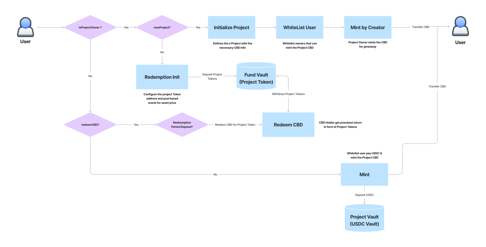

Capx-CBD
====================================

The project provides a decentralized platform allowing a project to issue community bonds(CBDs) 
This allows a project whitelist loyal member of the community. After this a project can decide to either giveaway CBDs or community can buy CBDs depending on the cost of CBD specified by the project.
The CBD(which would be a NFT) is a representation of a promise that after a specific amount of time the holder of CBD can redeem the NFT for the project tokens worth the promised amount.

Deploying the Smart Contracts
================================

Solana Programs when deployed involves sending multiple transactions to store the program logic in an specific account. The program ID is known from before as the transactions are signed using a new keypair.

User Flow
================================

Implementation Details 
======================

### Libraries Used

* `invoke_signed` - Used to do CPI with PDA as signer
* `AssociatedToken` - Used to determine the associated token account
* `{Burn, Mint, MintTo, Token, TokenAccount}` - Token operations 
* `mpl_token_metadata` - Used for dealing with metaplex metadata

### Functions

* `initialize` - Called by deployer as soon as program is deployed - sets USDC address
* `initialize_project` - Called by project owner to start a new project. The caller passes data like `projectID`,`name`,`symbol`,`metadataURI`,`max supply`,`currentvaluation`,`price per cbd`,`number of cbds of each type`,`total number of cbds`,`unlock time for each type of cbd`,`promised return of each type of cbd`
* `whitelist` - Called by the project owner to whitelist addresses to a project
* `initialize_cbd` - Called before first minting of CBD of a specific type
* `mint_cbd` - Called by user to mint cbd, this function also takes the USDC from caller and stores it in the program derived address
* `mint_cbd_creator` - Called by project owner to giveaway CBD
* `initialize_redemption` - Called by project owner to specify the project token address.
* `fund_vault` - Add funds to program in the form of project tokens which will be used to give promised return to CBD holders.
* `redeem_cbd` - Called by CBD holders to redeem the NFT for promised returns worth of project tokens
* `withdraw_fund` - Called by project owner to withdraw the funds accumilated by the usdc received from the minting of CBDs
* `edit_release_time` - Called by the project owner to change the redemption time for NFTs